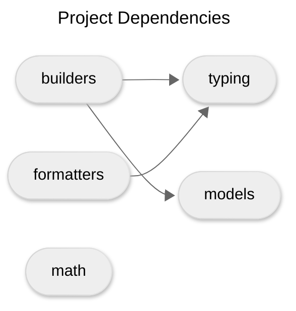

# Project Structure

```mermaid
---
title: Project Dependencies
config:
  layout: dagre
  look: neo
  theme: neutral
---
graph LR
A([models])
B([typing])
C([builders])
D([formatters])
E([math])
C --> B
C --> A
D --> B
```